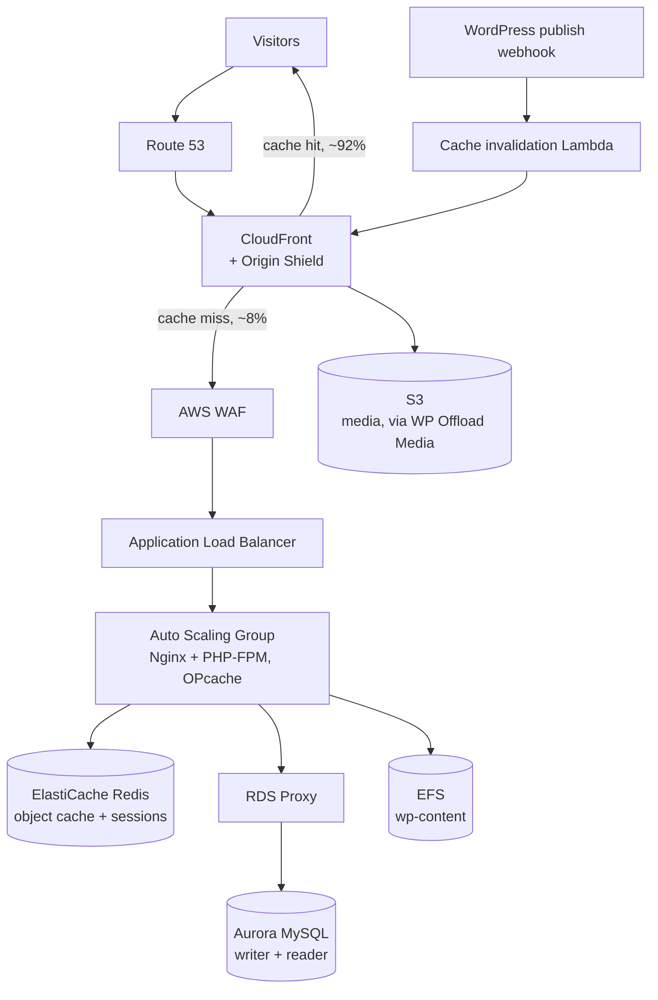

# wordpress-high-traffic-aws

**A production AWS architecture and Terraform implementation for a content/blog-style
WordPress site sized for 5M+ sessions per day, built around an aggressive caching
strategy rather than brute-force compute scaling.**

This is a generalized reference architecture, not tied to any real client, employer, or
production deployment. No real domain names, account IDs, or content are included.

---

## Why caching is the whole story here

For a content/blog/news/marketing site (as opposed to e-commerce or membership), almost
every page view is the same anonymous HTML for every visitor. That means the entire
problem is "how much of this traffic can we serve from cache before it ever reaches
WordPress," not "how many PHP-FPM workers do we need." Get the cache-hit ratio high
enough and a surprisingly small origin fleet handles a surprisingly large amount of
traffic. This README leads with that math because it's the actual design driver; every
other decision in this repo follows from it.

## Capacity planning

**Starting number:** 5,000,000 sessions/day.

Real traffic isn't flat across 24 hours. Using a 5x peak-to-average ratio (a reasonable
planning assumption for a content site with normal diurnal traffic, adjust up if the
audience is concentrated in one timezone, or a single article can plausibly go viral and
spike far harder than this):

```
Average requests/sec = 5,000,000 / 86,400 seconds  ≈ 58 req/s
Peak requests/sec     = 58 × 5                      ≈ 290 req/s
```

That 290 req/s is the number CloudFront has to absorb. The number that matters for the
origin fleet is what's left over after caching:

```
Assume 92% CloudFront cache-hit ratio (realistic for a blog/content site with a
sensible cache-control strategy, see "Cache invalidation" below):

Origin requests/sec at peak = 290 × (1 - 0.92) ≈ 23 req/s
```

23 req/s against a PHP-FPM + Nginx origin, with OPcache and Redis object cache in
front of the database, is comfortably handled by 2-3 mid-size instances. That's the
entire reason this architecture doesn't need a large EC2 fleet despite the headline
traffic number: **the cache-hit ratio is doing the heavy lifting, not horizontal compute
scale.** If your real cache-hit ratio comes in lower than 92% (logged-in admin traffic,
a misbehaving plugin bypassing cache, a lot of query-string variation defeating the
cache key), the origin fleet sizing in this repo will be undersized; that ratio is the
single most important number to monitor in production, not CPU utilization.

| Metric | Value |
|---|---|
| Sessions/day | 5,000,000 |
| Average req/s | ~58 |
| Peak req/s (5x) | ~290 |
| Assumed CDN cache-hit ratio | 92% |
| Origin req/s at peak | ~23 |
| Origin fleet (steady state) | 2x `t4g.medium` or `m6g.large` |
| Origin fleet (autoscale ceiling) | 6 instances, for cache-miss storms (e.g. a post going viral before cache warms, or a cache purge during a traffic spike) |

## Architecture



### Components

| Component | Terraform module | Role |
|---|---|---|
| Networking | `terraform/modules/networking` | VPC, public/private subnets across 3 AZs, NAT, route tables |
| Compute | `terraform/modules/compute` | ALB, Auto Scaling Group, launch template, scaling policies |
| Database | `terraform/modules/database` | Aurora MySQL cluster, reader instance, RDS Proxy |
| Cache | `terraform/modules/cache` | ElastiCache Redis replication group (object cache + sessions) |
| Storage | `terraform/modules/storage` | S3 media bucket, EFS filesystem and mount targets |
| CDN | `terraform/modules/cdn` | CloudFront distribution with Origin Shield, cache behaviors |
| Security | `terraform/modules/security` | WAF web ACL with WordPress-tuned managed rule groups, security groups |
| Cache invalidation | `scripts/cache-invalidation-lambda` | Lambda triggered by a WordPress publish webhook via a Function URL, invalidates the specific CloudFront path instead of the whole distribution, captures failures to SQS (see "Failure handling" below) |

## Cache invalidation strategy

The hard part of aggressive HTML caching is staleness: how does a published edit show
up quickly if CloudFront is holding a page for 10 minutes? Two complementary
mechanisms:

1. **Short-ish default TTL** (5-10 minutes) on HTML, so worst case staleness is bounded
   even if nothing else fires.
2. **Targeted invalidation on publish.** A WordPress webhook (`save_post` hook) calls
   the Lambda Function URL backed by `scripts/cache-invalidation-lambda`, which
   invalidates just the changed path(s) in CloudFront immediately, rather than
   purging the whole distribution (which would cause a cache-miss storm against the
   origin right after every single edit).

### Failure handling on a synchronously-invoked Lambda

This Lambda is invoked via a Function URL, which uses synchronous (`RequestResponse`)
invocation, not the asynchronous invocation that EventBridge or SNS use. That
distinction matters: Lambda's automatic async failure handling (Destinations, the
built-in DLQ config) only fires for asynchronous invocations. Wiring up an async DLQ on
a Function-URL-triggered Lambda the way you would for an EventBridge-triggered one
would be configured in Terraform but would never actually fire, a non-functional safety
feature that looks correct on paper. Instead, the handler itself catches a CloudFront
API failure and pushes it to an SQS queue before returning the error response (see
`handler.py`), and an optional CloudWatch alarm on the function's error rate notifies
on failures via `var.alert_email`.

## What's a realistic pattern vs. what's simplified for this portfolio

**Realistic / representative of real production patterns:**
- Leading the design with cache-hit ratio rather than compute capacity is exactly how a
  content-heavy WordPress site at this traffic level is actually architected; this
  isn't a simplification, it's the correct approach.
- Targeted cache invalidation on publish, instead of full-distribution purges, is a real
  and important operational detail, not a nice-to-have.
- Externalizing PHP sessions and object cache to Redis, so the app tier is genuinely
  stateless, is what makes the Auto Scaling Group actually safe to scale in and out.
- Matching the failure-handling mechanism to the actual invocation type (explicit SQS
  capture inside the handler for the synchronously-invoked Function URL Lambda, rather
  than an async Destinations/DLQ config that would silently never fire for this trigger
  type) is the kind of detail that's easy to get wrong by copying a pattern from a
  different trigger type without checking whether it actually applies.

**Simplified for portfolio purposes:**
- The 92% cache-hit ratio and 5x peak factor are reasonable planning assumptions, not
  measurements from a real site. Real cache-hit ratio depends heavily on the specific
  theme, plugins, and how much query-string/cookie variation exists in requests; this
  should be measured and tuned against real traffic, not trusted at the planning number.
- This architecture assumes mostly-anonymous, mostly-cacheable traffic (content, blog,
  news, marketing). It is explicitly not sized or designed for WooCommerce, memberships,
  or other heavily personalized/logged-in traffic; that's a meaningfully different
  architecture (cart/session persistence, payment compliance, far lower cache-hit
  ceiling) and would need its own design.
- The `environments/example` root module uses placeholder values throughout (no real
  domain, no real account ID, no real ACM certificate ARN); these are meant to be
  replaced, not used as-is.
- The bootstrap script (`scripts/bootstrap.sh`) installs and configures the stack but
  does not include an actual WordPress codebase or theme; in a real deployment that
  would come from your own CodeDeploy/CI pipeline or a baked AMI.

## Tech stack

`Terraform >= 1.5` · `Amazon CloudFront` · `AWS WAF` · `Application Load Balancer` ·
`EC2 Auto Scaling` · `Aurora MySQL` · `RDS Proxy` · `Amazon ElastiCache (Redis)` ·
`Amazon S3` · `Amazon EFS` · `AWS Lambda` · `Nginx` · `PHP-FPM`

## Usage

```bash
cd terraform/environments/example
cp terraform.tfvars.example terraform.tfvars   # fill in your own domain, ACM ARN, etc.
cp backend.tf.example backend.tf               # point at your own state backend
terraform init
terraform plan
```

### Validating without AWS credentials

```bash
terraform fmt -check -recursive
terraform validate   # requires `terraform init` to have completed
```

## License

MIT, see `LICENSE`.
