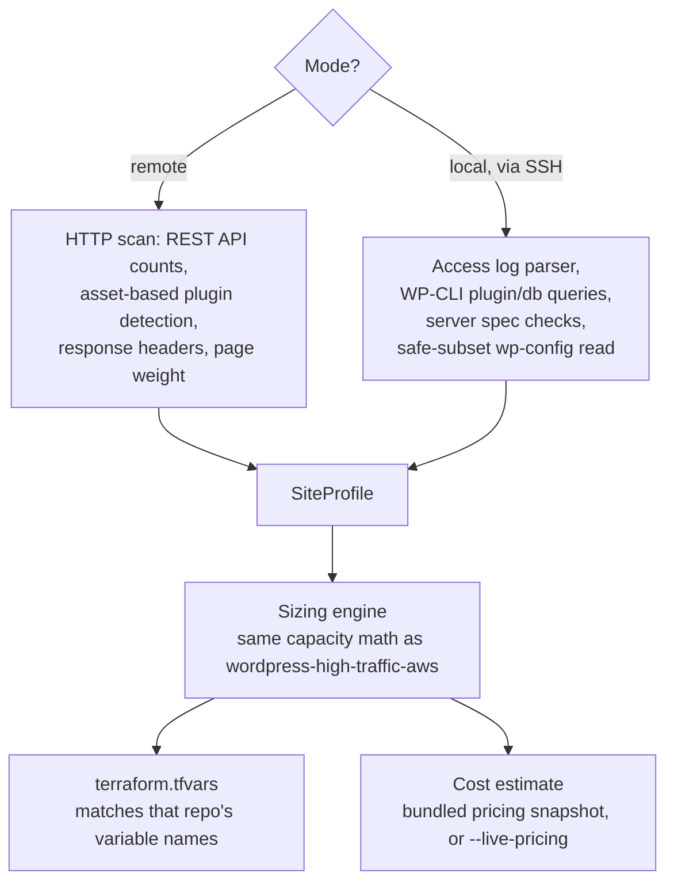

# wp2aws

**A migration-sizing tool for WordPress-to-AWS moves. Scans a real WordPress site
(remotely, or with deeper access if run on the server itself), sizes an AWS
architecture using the same capacity model as
[wordpress-high-traffic-aws](https://github.com/sauharddobhal/wordpress-high-traffic-aws),
and emits a ready-to-use `terraform.tfvars` plus a cost estimate.**

This exists to replace "guess your instance sizes and hope" with a sizing decision
grounded in either real measured traffic (server mode) or the best available external
signal (remote mode), and to be explicit about which one you're getting.

---

## The honesty problem this tool is built around

You cannot measure a site's real traffic from outside it. There is no external,
unauthenticated way to know how many sessions/day a WordPress site gets. Any tool that
claims to "auto-detect your traffic" from a URL alone is guessing or fabricating a
number. wp2aws has two modes specifically to be upfront about this distinction instead
of papering over it:

- **Remote mode** (`wp2aws scan <url>`): works against any public site, no access
  needed, but traffic is a number *you* provide (a real input, not a discovery), because
  there is no other honest way to get it from outside.
- **Local mode** (`wp2aws scan --local`, run on the server itself via SSH): reads real
  access logs, so traffic is measured, not asked for. This is the mode to use whenever
  you actually have server access, since every other input gets more accurate too (the
  exact plugin list, real database size, real server specs).

## What each mode actually gives you

| Signal | Remote mode | Local mode |
|---|---|---|
| Traffic (sessions/day, peak ratio) | User-provided input | Measured from access logs |
| Plugins/themes | Detected from public asset paths (misses backend-only plugins) | Exact list via WP-CLI |
| WooCommerce / membership detection | Heuristic, from detected plugin slugs | Definitive, from full plugin list |
| Page weight (drives the CloudFront cost line) | Measured from sampled pages (homepage + one post, HTML + linked assets via HEAD requests) | Not yet measured locally; falls back to the same default as an unconfigured remote scan |
| Database size | Not available | Measured via WP-CLI |
| Media library size | Not available | Measured directly |
| Server specs (CPU/RAM/disk) | Not available | Measured directly |
| Current cache behavior | Inferred from response headers | Inferred from response headers + config |

### Other report features

- **Data quality score**: every report leads with how many inputs were actually measured
  versus assumed (e.g. "4/6 inputs measured"), so the honesty distinction this tool is
  built around is visible at a glance, not just buried in per-line basis text.
- **Hosting cost comparison**: pass `--current-hosting-cost <monthly USD>` to see the AWS
  estimate stacked against what you're paying now, with the difference and a percentage
  change. This compares sticker price only, it does not account for migration engineering
  time or capability differences (autoscaling, managed failover) your current host may
  or may not offer.

## Architecture



### Components

| Component | File | Role |
|---|---|---|
| Remote scanner | `src/wp2aws/scanners/remote.py` | Public HTTP-only site scan, no credentials |
| Local scanner | `src/wp2aws/scanners/local.py` | Access-log parsing, WP-CLI calls, server specs |
| Secrets filter | `src/wp2aws/scanners/secrets_filter.py` | Allowlist-only wp-config.php reader; see "Safety" below |
| Sizing engine | `src/wp2aws/sizing/engine.py` | Maps a SiteProfile to an instance/cluster sizing tier |
| Cost estimator | `src/wp2aws/sizing/cost.py` | Monthly AWS cost estimate from the sizing decision; prefers measured page weight over the default assumption when available |
| Data quality scorer | `src/wp2aws/sizing/quality.py` | Counts how many inputs were measured vs. assumed, surfaced at the top of every report |
| tfvars renderer | `src/wp2aws/sizing/tfvars.py` | Emits `terraform.tfvars` matching `wordpress-high-traffic-aws`'s variable names |
| Report renderer | `src/wp2aws/report.py` | Renders the text/Markdown report, including the data-quality line and the optional hosting-cost comparison |

## Safety

- **Remote mode is read-only and respects `robots.txt`.** It checks `robots.txt` before
  making any request beyond that, identifies itself with a clear User-Agent
  (`wp2aws-scanner/<version>`), and only ever issues GET and HEAD requests (HEAD is used
  to measure linked asset sizes for the page-weight estimate without downloading their
  bodies). Only scan sites you own or have explicit permission to scan.
- **Local mode never reads or outputs secrets.** `wp-config.php` parsing uses a strict
  allowlist of constant names (`WP_CACHE`, `WP_DEBUG`, `DISABLE_WP_CRON`,
  `WP_MEMORY_LIMIT`, `WP_MAX_MEMORY_LIMIT`). `DB_PASSWORD`, `DB_USER`, all auth
  keys/salts, and anything not on that allowlist are never extracted, full stop, not
  filtered after the fact. See `src/wp2aws/scanners/secrets_filter.py`.
- **WP-CLI and log access run with whatever permissions your shell session already
  has.** This tool does not escalate privileges or modify anything on the server; every
  operation it performs is a read.

## What's a realistic pattern vs. what's simplified for this portfolio

**Realistic / representative of real production patterns:**
- The remote/local distinction and being explicit about which inputs are measured
  versus assumed is the actual right way to think about sizing, not a simplification.
- Routing the sizing math through the same capacity model as `wordpress-high-traffic-aws`
  (peak-to-average ratio, cache-hit-ratio-driven origin load) means the two repos tell a
  consistent, honest story rather than two unrelated approaches to the same problem.
- The allowlist-only approach to reading `wp-config.php` (rather than reading everything
  and trying to redact secrets afterward) is the safer pattern; redaction-after-the-fact
  is the kind of thing that quietly fails when a new secret-like constant gets added
  later and nobody updates the redaction list.

**Simplified for portfolio purposes:**
- The cost estimate uses a bundled, dated pricing snapshot (`data/pricing_snapshot.json`)
  by default, so the tool runs offline with zero AWS credentials. Pass `--live-pricing`
  to fetch current prices from AWS's public Bulk Pricing API instead (no AWS credentials
  needed for that either, just outbound internet access). The bundled snapshot WILL
  drift from real pricing over time; treat default-mode estimates as directional, not a
  quote.
- This tool produces a starting `terraform.tfvars`, not a finished migration. DNS
  cutover, database export/import, and media sync to S3 are real steps it does not
  automate.
- Remote-mode plugin detection is asset-path heuristics and will miss backend-only
  plugins (anything that doesn't enqueue a front-end script or stylesheet). Local mode's
  WP-CLI-based detection doesn't have this limitation.

## Setup

```bash
git clone https://github.com/sauharddobhal/wp2aws.git
cd wp2aws
python -m venv .venv && source .venv/bin/activate
pip install -r requirements.txt
```

### Demo (zero network calls, zero setup)

```bash
python -m wp2aws demo
```

Runs the full pipeline against a bundled synthetic site profile so you can see the
sizing engine, cost estimate, and tfvars output without scanning anything real.

### Remote scan

```bash
python -m wp2aws scan https://example.com --sessions-per-day 50000
```

### Local scan (run this ON the WordPress server, e.g. over SSH)

```bash
python -m wp2aws scan --local --access-log /var/log/nginx/access.log
```

### Exporting the sizing result

```bash
python -m wp2aws scan https://example.com --sessions-per-day 50000 \
  --export-tfvars terraform.tfvars --export-report report.md \
  --current-hosting-cost 200
```

`terraform.tfvars` can be copied directly into
`wordpress-high-traffic-aws/terraform/environments/example/`.

### Running tests

```bash
pytest tests/
```

## License

MIT, see `LICENSE`.
